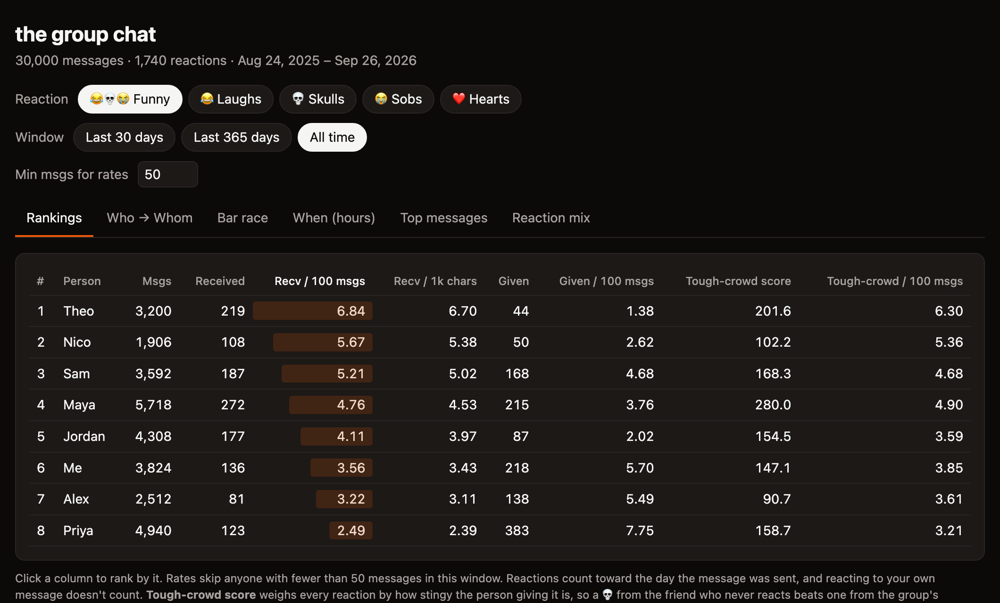

# ChatWrapped

I saw this on Instagram and wanted to reimplement. It’s essentially Spotify Wrapped, but for your IMessage group chat. Measures laugh, heart, skull, or sob reactions with various metrics.



Rankings, who reacts to whom, a bar race, when people are funniest, the top messages (click one to
jump to it in Messages), and everyone's signature reaction. Runs entirely on your Mac. Nothing is uploaded.

## Use

```bash
pipx install git+https://github.com/dhruvraajeev/chatwrapped
chatwrapped
```

Pick a chat and your dashboard opens in the browser. On first run, give your terminal
**Full Disk Access** (System Settings → Privacy & Security) so it can read Messages.

Sharing it with the group? `chatwrapped --hide-text` leaves message text out.

## Run from source

- Clone it: `git clone https://github.com/dhruvraajeev/chatwrapped && cd chatwrapped` (needs only the Python 3 that comes with macOS)
- Give your terminal app Full Disk Access in System Settings → Privacy & Security, then restart it
- Run `PYTHONPATH=src python3 -m chatwrapped` and pick a chat by number (or pass a chat name, or `--list` to see them all)
- The dashboard is saved to `~/ChatWrapped/<chat>.html` and opens in your browser; rerun to refresh it, and run the tests with `PYTHONPATH=src python3 -m unittest discover tests`

MIT licensed.
